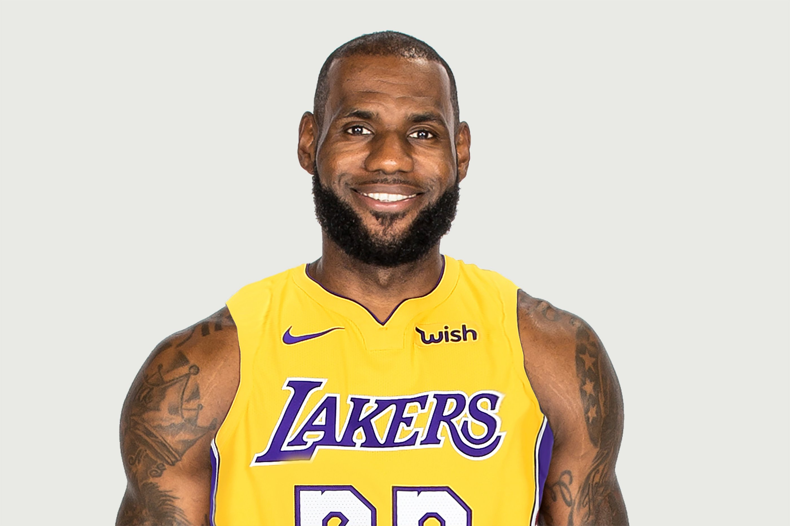
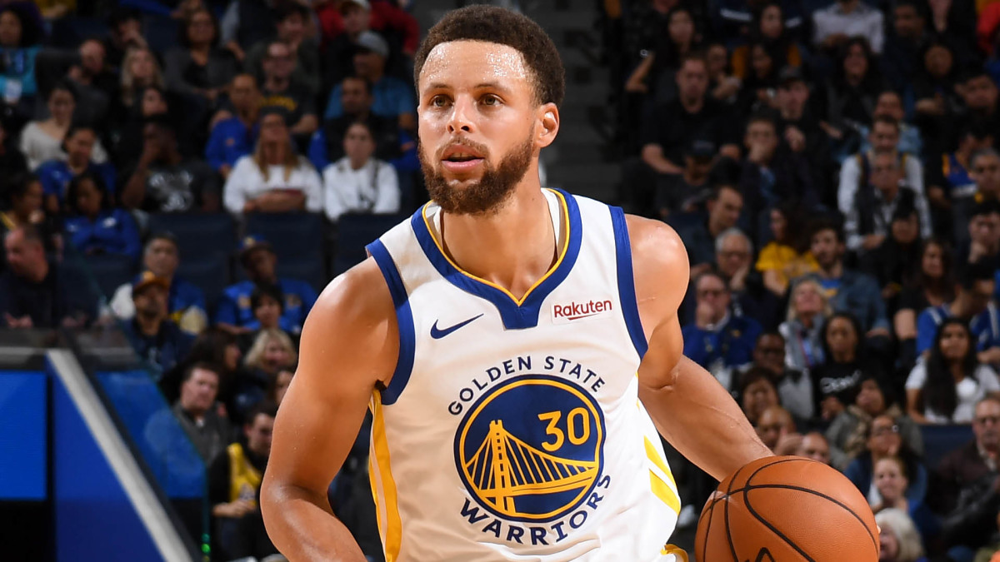
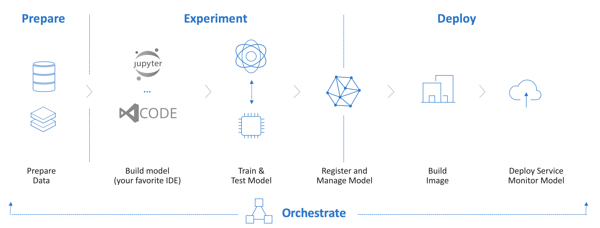

# Professional Athlete Classifier Using Azure Machine Learning Service 

The following tutorial demonstrates an end-to-end workflow for training and deploying a **Tensorflow 2.0** model on Azure Machine Learning Service. The notebook will cover the following topics:

- Azure Machine Learning service workspace and basic concepts
- Creating a dataset using Azure Cognitive Services and hosting it on a blob datastore
- Setting up an auto-scaling AML Compute cluster
- Training a distributed model across multiple nodes and GPUs
- Deploying a model and creating a web service endpoint

## Problem Statement

Professional sporting events have the power to bring friends, families, and co-workers together at home, at bars, and at the venue itself. While most people enjoy the social aspect and the entertainment of the game, few can recognize every single athlete that is on the court, field, or ice.

In this demo, we will be building a model that help solves this problem by classifying NBA players based upon their photo. While this can be extended to a multi-classification problem, this example will focus on a binary classification between two of the top NBA players today - Lebron James and Stephen Curry.

<table>
    <tr>
        <td>
            <h2>Lebron James</h2>
            
        </td>
        <td>
            <h2>Stephen Curry</h2>
            
        </td>
    </tr>
</table>

## What is Azure Machine Learning Service?
Azure Machine Learning service is a cloud service that you can use to develop and deploy machine learning models. Using Azure Machine Learning service, you can track your models as you build, train, deploy, and manage them, all at the broad scale that the cloud provides.
